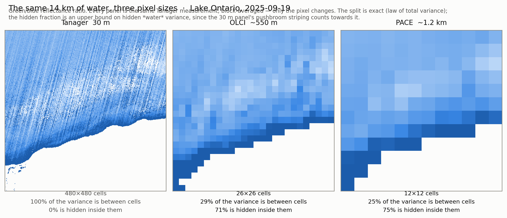
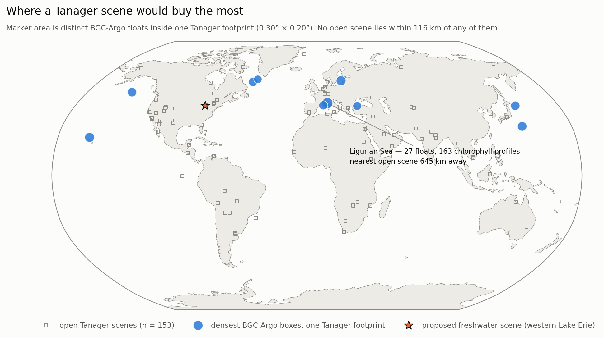

# The homogeneity nobody can check

**Measuring the sub-pixel variance that ocean-color match-up protocols assume away —
with Tanager, PACE and Sentinel-3 over the same water on the same day.**

**Charlie Turner** · 28 August 2026

Tanager Open Data Competition · three open scenes · methods and full results in
[METHODS.md](METHODS.md) · code and data at
[github.com/cjt31415/tanager-subpixel](https://github.com/cjt31415/tanager-subpixel)

---

## Project Summary

Every satellite ocean-color product is validated the same way: a satellite pixel is
compared against an in-situ measurement, and the match-up is accepted only if the water
looks homogeneous. The standard test (Bailey & Werdell 2006) takes a 5×5 box of satellite
pixels around the station and accepts it when the **coefficient of variation across those
25 pixels is below 0.15**.

That is a *between-pixel* statistic. It says nothing about the water **inside** each
pixel — and it cannot, because the sensor doing the filtering is the sensor being
validated. A PACE pixel is 1.2 km across. The protocol assumes what happens inside it is
uniform enough not to matter. That assumption has never been checked with a
hyperspectral sensor, on the same day, at this ratio of samples per pixel.

Tanager can. At 30 m it resolves ~300 samples inside one Sentinel-3 OLCI cell (Copernicus L3) and
1,600–3,000 inside one PACE pixel. We took three open Tanager scenes with same-day PACE
OCI and Sentinel-3 OLCI coverage, binned every 30 m water pixel into the coarse pixel that
contains it, and asked the question the protocol cannot: **where, across scale, does the
water's variance actually sit?**

| scene | Tanager | PACE OCI | Δt | OLCI (CMEMS L3) |
|---|---|---|---|---|
| San Francisco Bay, 2025-05-14 | 19:39:37 | 19:35:44 | **4 min** | S3A 18:22 |
| Lake Ontario (Rochester), 2025-09-19 | 17:02:33 | 17:39:46 | 37 min | same day |
| Loreto, Gulf of California, 2025-08-31 | 18:51:20 | 19:35:44 | 44 min | same day |

*Times UTC. Δt is Tanager − PACE. OLCI comes from the Copernicus daily L3 merge, which
keeps no pass time; the S3A time for San Francisco Bay is from the Sentinel-3 catalog.*

Before any 30 m claim, Tanager has to reproduce a sensor that has none of its problems at
a scale that sensor can see. Aggregated onto the OLCI grid it reproduces OLCI's *spatial
variability* — not merely its pattern — to within **9 %** at Lake Ontario, and 44–80 %
high at the two hazier scenes. The residual there is multiplicative, which the green/blue
ratio divides out, and the headline below is a *fraction* of variance, which no overall
scale factor can move. That is what licenses everything below (METHODS §2).

## The result

***The same 14 km of Lake Ontario at 30 m, ~550 m and ~1.2 km.** The 560/490 nm
ratio from one Tanager scene, block-averaged to each coarse pixel; the fraction of its
variance that each pixel size hides is printed under the panel.*

**Across all three scenes, roughly seven-tenths of the 30 m variance in the water's
color is invisible to a ~550 m OLCI cell, and three-quarters to PACE.** This is an exact
split — the law of total variance applied to one field over one 14.4 km window at two
block sizes. It needs no threshold, no second instrument, and no protocol. We computed it
for two quantities: the green/blue ratio, and plain 560 nm reflectance.

| scene | | hidden inside an OLCI cell (~550 m) | hidden inside a PACE pixel (~1.2 km) |
|---|---|---|---|
| San Francisco Bay | color · brightness | 69 % · 71 % | 75 % · 78 % |
| Lake Ontario | color · brightness | **71 %** · 14 % | **75 %** · 27 % |
| Loreto, Gulf of California | color · brightness | 68 % · 18 % | 78 % · 35 % |

**The two quantities do not agree, and the disagreement is the sharpest result here.**
The water's *color* varies at fine scale: seven-tenths of it is inside the pixel, in
every scene. Its *brightness* mostly does not — at Lake Ontario and Loreto, 86 % and 82 %
of the brightness variance is between OLCI cells, exactly the scale a coarse sensor
resolves. (San Francisco Bay, uniformly turbid at half a kilometer with no large-scale
gradient to carry brightness variance, behaves like its color field.)

That is why the homogeneity filter looks like it is working. **It is applied to
brightness** — the coarse sensor's reflectance or its chlorophyll retrieval — **and
brightness is the quantity whose variance a coarse sensor can mostly see.** What a
match-up then certifies is a color-derived quantity, and color's variance is where the
filter cannot look. The filter is screening the one thing that passes its own test.

The same finding in the protocol's own terms: across **1,528 boxes that pass the standard
CV < 0.15 filter**, the water's color inside an accepted pixel is **3.3–5.4× more
variable than it is between the accepted pixels** at Lake Ontario and Loreto, and 1.3× at
San Francisco Bay. **36 % of accepted boxes have a center pixel whose own interior is
more variable than the 0.15 threshold the box just cleared; 63 % contain such a pixel
somewhere.** Per-scene numbers, the brightness variant, and three supporting checks — the
variability is spatially structured rather than noise, and clears Tanager's own declared
uncertainty by 1.5–5.5× — are in METHODS §3–4.

## Impact Statement

**The homogeneity filter is not measuring what it is used to certify.** It is a real and
useful screen against *scene-scale* patchiness — cloud edges, fronts crossing the box —
and it is doing that job. But it is routinely read as evidence that a point measurement
represents the pixel, and on this evidence it does not support that reading: the quantity
it screens and the quantity it certifies have their variance at different scales.
Brightness is mostly resolvable and passes; color, which is what a chlorophyll retrieval
is built from, is 68–71 % sub-pixel in every scene we measured.

Three things follow, in increasing order of effort:

1. **Report the assumption.** Match-up protocols should state that the sub-pixel term is
   unmeasured, not zero. That costs nothing and changes how uncertainty budgets are read.
2. **Do not read a passing box as a representative pixel.** The two are different claims
   about different scales, and the first is not evidence for the second.
3. **Measure the term, at the sites where it matters.** It is now measurable. That is a
   tasking question, and it is the one thing this study could not do: no open Tanager
   scene sits at any ocean-color validation site with in-situ truth.

**Who this reaches:** every satellite ocean-color validation program — NASA's PACE
validation effort, ESA's OLCI cal/val, the AERONET-OC network — plus the BGC-Argo
community, whose ~2,900 floats are compared to satellite pixels by exactly this logic.

That comparison is not hypothetical: [CHLA-Z](https://fish-pace.github.io/chla-z/) pairs
PACE OCI **L3-mapped** Rrs (4 km) with Bio-Argo and OOI chlorophyll profiles to estimate
chlorophyll with depth — the join measured here, one rung coarser again. The sub-pixel
term is a free parameter in every such join.

## Where Tanager should go next

Two sites, chosen two ways. For the open ocean we ranked every Tanager-footprint-sized box
on Earth (0.30° × 0.20°, the median of all 153 open scenes) by BGC-Argo float density,
using both readings of "dense", because they disagree: ranking by *profiles* selects
marginal seas where a few trapped floats cycle fast; ranking by *distinct floats* selects
where a scene would catch a fleet. For fresh water, where there are no floats, we asked
the same question of a fixed in-situ network instead.

- **Ocean — the Ligurian Sea (7.65–7.95 °E, 43.25–43.45 °N).** 27 distinct BGC-Argo
  floats, 218 profiles, **163 of them carrying chlorophyll**, 9 floats still there since
  2023. We ranked this box on float density alone, with no knowledge of what else is
  there — and it contains **BOUSSOLE (43°22′ N, 7°54′ E)**, the buoy that has provided
  Europe's ocean-color vicarious calibration and validation time series since 2003.
  One Tanager footprint would cover the mooring, the float cluster and the water they
  share — and would, for the first time, put a measured sub-pixel term on a
  satellite-to-float chlorophyll match-up rather than an assumed one. **The nearest open
  Tanager scene is 645 km away, inland in Germany; no open scene lies within 116 km of
  any of the top float boxes.**
- **Freshwater — western Lake Erie (center 41.80 °N, 83.28 °W).** The longest
  cyanobacteria-bloom record in North America, with NOAA GLERL/CIGLR sampling three depths
  weekly at seven master stations. Two open Tanager scenes already cover the western basin
  — and **not one of the 16 stations falls inside either frame**; the nearest is 10.4 km
  outside. One footprint moved 25 km south would contain **10 stations, 7 of them weekly
  CTD stations**, plus two continuous buoys.

That second case is the whole argument in miniature. The scenes exist, the in-situ network
exists, and they miss each other by ten kilometers.

***Where a Tanager scene would buy the most.** The densest BGC-Argo boxes, one
Tanager footprint each (marker area = distinct floats), the 153 open Tanager scenes, and
the proposed western Lake Erie frame. No open scene lies within 116 km of any float
box.*

## Limitations

- **Tanager's atmospheric correction is tuned for land**, and over water its quality is
  scene-dependent — 1600 nm reflectance runs 0.0025 (Lake Ontario) to 0.097 (San Francisco
  Bay, 29 % haze). We remove the residual per band from the darkest water in each scene.
- **Every CV here is a lower bound**, and the hidden-variance fractions are **upper
  bounds** on hidden *water* variance — the pushbroom's column striping counts toward the
  within-cell term.
- Variability is measured on a **band ratio, not chlorophyll** — the color signal a
  retrieval is built from, not the retrieval itself.
- **No in-situ data are used.** That is the point of the tasking section.

METHODS §5 states each of these in full, §6 records which gates were pre-registered and
which one was added on revision.

*Data: Planet Tanager open scenes (CC-BY-4.0); NASA PACE OCI L2 (AOP, BGC); Copernicus
Marine OCEANCOLOUR_GLO_BGC_L3_MY_009_103; the BGC-Argo global index; NOAA GLERL/CIGLR
station positions after Boegehold et al. 2023, ESSD 15:3853.*
